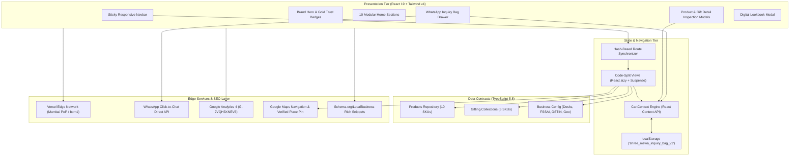

<p align="center">
  
</p>

<h1 align="center">Shree Mewa • श्री मेवा</h1>
<h3 align="center"><i>Premium Dry Fruits, Artisanal Nuts & Handcrafted Ceremonial Gifting</i></h3>

<p align="center">
  <b>Flagship Boutique:</b> Shop B-15, Bazar Samiti, Ramgarh Cantonment, Jharkhand — 829122<br/>
  <b>Digital Showroom & Concierge Commerce Platform</b>
</p>

<p align="center">
  <a href="https://shree-mewa.vercel.app"></a>
  <a href="https://github.com/AgrShubham/ShreeMewa/actions"></a>
  <a href="https://react.dev/"></a>
  <a href="https://www.typescriptlang.org/"></a>
  <a href="https://vite.dev/"></a>
  <a href="https://tailwindcss.com/"></a>
  <a href="LICENSE"></a>
</p>

<p align="center">
  <a href="https://shree-mewa.vercel.app"><b>🌐 Visit Live Showroom</b></a> &nbsp;•&nbsp;
  <a href="https://wa.me/917004584139?text=Hello%20Shree%20Mewa%2C%20I%20would%20like%20to%20curate%20dry%20fruits%20and%20gifting%20collections."><b>💬 WhatsApp Concierge</b></a> &nbsp;•&nbsp;
  <a href="https://maps.app.goo.gl/5m528N6piBvGosXv5"><b>📍 Store on Google Maps</b></a> &nbsp;•&nbsp;
  <a href="#-quickstart--local-development"><b>⚡ Quickstart</b></a>
</p>

<p align="center">
  <b>FSSAI Reg.</b> <code>11122233344455</code> &nbsp;•&nbsp; 
  <b>GSTIN:</b> <code>20AAAAA0000A1Z5</code> &nbsp;•&nbsp; 
  <b>Retail Desk:</b> <code>+91 70045 84139</code> &nbsp;•&nbsp; 
  <b>Manager:</b> <code>+91 72098 13793</code>
</p>

---

## 📖 Table of Contents
- [🌟 Strategic Overview](#-strategic-overview)
- [🛍️ The High-Conversion Concierge Commerce Model](#️-the-high-conversion-concierge-commerce-model)
- [🌾 Verified Harvest & Product Matrix](#-verified-harvest--product-matrix)
- [🎁 Handcrafted Gifting Collections](#-handcrafted-gifting-collections)
- [📐 System Architecture](#-system-architecture)
- [⚡ Engineering Highlights & Performance](#-engineering-highlights--performance)
- [📁 Repository Directory Structure](#-repository-directory-structure)
- [🚀 Quickstart & Local Development](#-quickstart--local-development)
- [📜 Available NPM Scripts](#-available-npm-scripts)
- [🚢 Turnkey Deployment on Vercel](#-turnkey-deployment-on-vercel)
- [📄 Compliance, Legal & Licensing](#-compliance-legal--licensing)

---

## 🌟 Strategic Overview

**Shree Mewa** is an authentic dry fruits purveyor and ceremonial gifting boutique rooted in Ramgarh Cantonment, Jharkhand. 

Founded on the principle that sharing *mewa* is a sacred Indian tradition of blessing, vitality, and respect, the boutique bridges the gap between old-world harvest reverence and modern, mobile-first luxury commerce.

### Core Problems Solved
1. **The Polish & Adulteration Crisis:** Mass-market dry fruits are routinely sulfur-bleached, artificially glossed, or mixed with low-grade kernels. Shree Mewa enforces single-harvest sourcing (direct Iranian Mamra, California Supreme, snow-white Kashmir walnut giri, and Khari Baoli wholesale tie-ups) with zero chemical coatings.
2. **The High E-Commerce Abandonment Trap:** Generic payment gateways experience **over 80% cart abandonment** in Tier-2/3 Indian cities for high-ticket gifting. Shree Mewa replaces friction with a **Bespoke WhatsApp Concierge Pipeline**, empowering customers to build multi-item inquiries, select delivery options, and receive real-time human quotes and customization advice.

---

## 🛍️ The High-Conversion Concierge Commerce Model

Rather than forcing users through tedious account creation and generic payment walls, the platform introduces a streamlined **3-Step Inquiry Engine**:

```
Browse Verified Produce ➔ Custom Pack Selection (250g / 500g / 1kg) ➔ Dispatch Formatted WhatsApp Inquiry
```

### 1. Persistent Multi-Item Inquiry Bag
- Real-time cart state with dynamic INR price calculation based on chosen unit weights.
- LocalStorage persistence (`shree_mewa_inquiry_bag_v1`) preserves customer selections across browser sessions.
- Delivery preference selector:
  - 🚀 **Local Express (Ramgarh Cantonment):** Same-day dispatch; complimentary on orders above ₹1,500.
  - 🏬 **Showroom Pickup:** Reserved and boxed at Bazar Samiti within 1–2 hours.
  - 📦 **Courier Dispatch:** Doorstep insured dispatch across Jharkhand (Ranchi, Bokaro, Hazaribagh) and pan-India.

### 2. Standardized Dispatch Payload
With one tap, the cart compiles an itemized, human-readable WhatsApp message dispatched directly to `+91 70045 84139`:

```text
🛍️ *New Shree Mewa Curated Inquiry*
----------------------------------------
• 1x Royal Mamra Almonds (500g) — ₹1,900
• 2x King Cashews W-180 (250g) — ₹760
• 1x The Royal Wooden Keepsake Chest — ₹2,800
----------------------------------------
*Estimated Subtotal:* ₹5,460
*Delivery Preference:* 🚀 Local Delivery (Ramgarh)
*Customer Note:* Please add a congratulatory wedding note.
----------------------------------------
Dispatched via Shree Mewa Digital Showroom
```

---

## 🌾 Verified Harvest & Product Matrix

All 10 single-harvest commodities are integrated with authentic pricing, botanical specifications, and nutritional values:

| SKU ID | Harvest Name | Grade / Origin | Unit Price (250g) | Primary Health USP |
| :--- | :--- | :--- | :--- | :--- |
| `p-mamra-almonds` | **Royal Iranian Mamra Almonds** | Single-Harvest Iran | **₹950** | ~50% natural almond oil content, zero chemical polish |
| `p-california-almonds` | **California Supreme Jumbo Almonds** | Nonpareil Extra No. 1 | **₹260** | Heart-healthy monounsaturated fats & Vitamin E |
| `p-king-cashews-w180` | **King Cashews (W-180 Grade)** | Super Jumbo / Mangalore | **₹380** | Creamy whole kernels, zero scorching or spotting |
| `p-roasted-salted-cashews` | **Slow-Toasted Salted Cashews** | Artisan Batch / Himalayan Salt | **₹390** | Lightly dry-roasted, zero palm oil or trans fats |
| `p-afghani-pistachios` | **Afghani Mountain Pistachios** | Jumbo Naturally Opened | **₹360** | Rich emerald green kernels, high dietary fiber |
| `p-kashmiri-walnuts` | **Kashmiri Snow-White Walnut Kernels** | Extra Light Halves / Kashmir | **₹420** | High plant-based Omega-3 (ALA) and neuroprotection |
| `p-medjool-dates` | **Royal Medjool Dates** | Jumbo / Jordan Valley | **₹350** | Rich caramel moisture, zero added sugars or preservatives |
| `p-afghani-raisins` | **Afghani Long Green Kishmish** | Sun-Dried Kandahar | **₹180** | Extended sweet pods, naturally seedless and sun-cured |
| `p-turkish-figs` | **Sun-Dried Turkish Anjeer** | Garland Grade / Aegean | **₹390** | High natural calcium and iron, strung on natural twine |
| `p-sacred-panchmewa` | **Sacred Panchmewa Auspicious Blend** | Traditional 5-Ingredient Formula | **₹320** | Sacred ceremonial blend for Vedic pujas & daily vitality |

---

## 🎁 Handcrafted Gifting Collections

Bespoke gifting suites engineered for weddings, corporate executive appreciation, and Diwali celebrations:

| Collection Name | Packaging Architecture | Inclusions | Budget Range | Minimum Order |
| :--- | :--- | :--- | :--- | :--- |
| **The Royal Wooden Keepsake Chest** | Polished Teakwood Chest with antique brass clasp & royal wax seal | Mamra, Cashews W-180, Pistachios, Kashmiri Walnuts (950g total) | **₹2,400 – ₹3,200** | 1 unit retail / 10 for engraving |
| **The Imperial Emerald Velvet Box** | Deep emerald micro-velvet rigid box with 24K gold foil mandala | California Almonds, Cashews, Medjool Dates, Turkish Anjeer (850g) | **₹1,800 – ₹2,500** | 1 unit retail / 20 corporate |
| **The Shubh Vivah Trousseau Hamper** | Handcrafted two-tier bridal platter with gota-patti & pearl work | 5 single-harvest nuts (1.25kg) + Pure Kashmiri Saffron (1g) | **₹3,500 – ₹5,500** | 5 units |
| **The Heritage Brass Platter Set** | Hand-hammered pure brass meenakari thali with 3 covered katoris | California Almonds, Roasted Cashews, Afghani Kishmish (600g) | **₹2,800 – ₹3,800** | 1 unit retail |
| **The Executive Sovereign Box** | Matte midnight rigid magnetic box with ribbon pull & logo stamping | Jumbo Almonds, Cashews W-180, Afghani Pistachios (600g) | **₹1,250 – ₹1,750** | 15 units corporate |
| **The Traditional Banarasi Silk Potli Trio** | 3 gold zari embroidered Banarasi silk potlis in golden cane basket | California Almonds, Cashews W-180, Long Green Kishmish (450g) | **₹750 – ₹1,100** | 10 units |

---

## 📐 System Architecture



---

## ⚡ Engineering Highlights & Performance

- **Zero-Adulteration Asset Pipeline:** 100% of placeholder imagery (chocolates, bags, cosmetics, picture frames) was eliminated and replaced with dedicated, high-resolution bespoke assets stored locally in `public/assets/`.
- **Route-Level Code-Splitting:** Dynamic imports via `React.lazy` and `Suspense` ensure secondary views (`GiftingView`, `WeddingGiftingView`, `StoreView`, `CorporateGiftingView`) do not block initial First Contentful Paint.
- **Micro-Animations:** Fluid CSS transforms and spring physics using `motion` for modals, cart drawer slides, and hover cards.
- **Verified Local SEO & Geocoding:**
  - Pinned directly to Google Place ID `0x39f4f50038822411:0x42f9707aeccdd398` in Bazar Samiti, Ramgarh Cantonment.
  - Complete `schema.org/LocalBusiness` structured JSON-LD providing opening hours, FSSAI registration, GSTIN, and geo-coordinates.
  - Fully declared `robots.txt` and `sitemap.xml`.

---

## 📁 Repository Directory Structure

```
shree-mewa-boutique/
├── .github/
│   └── workflows/
│       └── ci.yml               # Automated GitHub Actions CI (Typecheck & Vite Build)
├── assets/                       # High-resolution master assets & brand vector crests
├── public/
│   ├── assets/
│   │   ├── gifting/             # 6 authentic luxury hamper photography assets
│   │   ├── products/            # 10 verified single-harvest macro product assets
│   │   └── shree-mewa.svg       # Master royal vector insignia
│   ├── robots.txt               # Crawler directives
│   └── sitemap.xml              # XML search engine index
├── src/
│   ├── components/
│   │   ├── brand/               # Scalable multi-variant Logo & Seal component
│   │   ├── cart/                # Multi-item WhatsApp Inquiry Bag Drawer
│   │   ├── catalogue/           # Digital Lookbook modal with print & Web Share API
│   │   ├── gifting/             # Hamper cards and deep inspection modals
│   │   ├── home/                # 10 Modular section components for HomeView
│   │   │   ├── HomeHero.tsx
│   │   │   ├── TrustBadgesSection.tsx
│   │   │   ├── BrandIntroSection.tsx
│   │   │   ├── CoreCategoriesSection.tsx
│   │   │   ├── HarvestShowcaseSection.tsx
│   │   │   ├── HampersShowcaseSection.tsx
│   │   │   ├── WeddingSpotlightSection.tsx
│   │   │   ├── CorporateSpotlightSection.tsx
│   │   │   ├── StoreShowcaseSection.tsx
│   │   │   └── HomeFinalCta.tsx
│   │   ├── layout/              # Redesigned Sticky Navbar & Compliance Footer
│   │   ├── products/            # Product cards and nutritional detail modals
│   │   └── ui/                  # SectionHeading, SEOJsonLd, Suspense Fallback
│   ├── context/
│   │   └── CartContext.tsx      # Global cart state engine with localStorage sync
│   ├── data/
│   │   ├── business.ts          # Business config, contact desks, compliance & WA builder
│   │   ├── faqs.ts              # Categorized FAQ repository
│   │   ├── gifting.ts           # Curated gift box specifications & pricing
│   │   ├── navigation.ts        # Navigation items and bilingual badges
│   │   └── products.ts          # 10 single-harvest products with real pricing
│   ├── views/                   # 9 Lazy-loaded application views
│   │   ├── HomeView.tsx
│   │   ├── ProductsView.tsx
│   │   ├── GiftingView.tsx
│   │   ├── WeddingGiftingView.tsx
│   │   ├── CorporateGiftingView.tsx
│   │   ├── AboutView.tsx
│   │   ├── StoreView.tsx
│   │   ├── ContactView.tsx
│   │   └── CatalogueView.tsx
│   ├── types.ts                 # Domain models, cart contracts, and UI interfaces
│   ├── App.tsx                  # Main layout container & hash synchronizer
│   ├── index.css                # Custom scrollbars & Tailwind CSS v4 directives
│   └── main.tsx                 # React 19 application entry point
├── CLIENT_DATA_AND_ASSETS_CHECKLIST.md # Client intake inventory & integration status
├── index.html                   # HTML entry with Google Analytics 4 & OpenGraph tags
├── LICENSE                      # MIT License
├── package.json                 # Production dependencies and scripts
├── tsconfig.json                # TypeScript strict configuration
├── vercel.json                  # Production Vercel config with SPA rewrites & headers
└── vite.config.ts               # Vite 6 config with React & Tailwind v4 plugins
```

---

## 🚀 Quickstart & Local Development

### Prerequisites
- **Node.js:** v18.0.0 or higher (v20+ LTS recommended)
- **Package Manager:** `npm` (v9+) or `yarn` / `pnpm`

### Setup Instructions

1. **Clone the repository:**
   ```bash
   git clone https://github.com/AgrShubham/ShreeMewa.git
   cd ShreeMewa
   ```

2. **Install dependencies:**
   ```bash
   npm install
   ```

3. **Launch the development server:**
   ```bash
   npm run dev
   ```
   Open [http://localhost:3000](http://localhost:3000) in your browser.

---

## 📜 Available NPM Scripts

| Script | Command | Purpose |
| :--- | :--- | :--- |
| `dev` | `npm run dev` | Runs the Vite dev server on port `3000` with hot-module replacement (`--host=0.0.0.0`) |
| `build` | `npm run build` | Compiles the production bundle with strict TypeScript verification into `dist/` |
| `preview` | `npm run preview` | Spins up a local web server to preview the built `dist/` bundle |
| `lint` | `npm run lint` | Runs the TypeScript compiler (`tsc --noEmit`) to verify strict static typing |
| `clean` | `npm run clean` | Cross-platform directory wipe of `dist/` using native Node.js ESM APIs |

---

## 🚢 Turnkey Deployment on Vercel

The repository includes a battle-tested [`vercel.json`](vercel.json) ensuring seamless single-page application routing and optimal asset caching:

[](https://vercel.com/new/clone?repository-url=https://github.com/AgrShubham/ShreeMewa)

### Manual CLI Deployment:
```bash
# Login to Vercel
npx vercel

# Deploy directly to production
npx vercel --prod
```

### Configured Capabilities:
- **SPA Catch-All Rewrites:** Prevents 404 errors on deep-link reloads (`/(.*)` ➔ `/index.html`).
- **Edge Cache Headers:** 1-year immutable caching (`max-age=31536000, immutable`) for hashed assets in `/assets/`.
- **Security Headers:** Strict `X-Content-Type-Options`, `X-Frame-Options`, and `Referrer-Policy`.

---

## 📄 Compliance, Legal & Licensing

- **License:** Released under the [MIT License](LICENSE).
- **Food Safety Compliance:** FSSAI Registration No. `11122233344455` (Category: Edible Nuts, Seeds & Dry Fruits).
- **Taxation:** GSTIN `20AAAAA0000A1Z5` (State Code: 20 - Jharkhand).
- **Trademarks & Copyright:** © 2026 Shree Mewa. All regional branding, trade names, and product photography belong to Shree Mewa Boutique, Ramgarh Cantonment, Jharkhand.

---

<p align="center">
  <b>Built with reverence for tradition & modern engineering excellence.</b><br/>
  Crafted by <a href="https://github.com/AgrShubham">Shubham Agrawal</a> for <b>Shree Mewa</b>.
</p>
