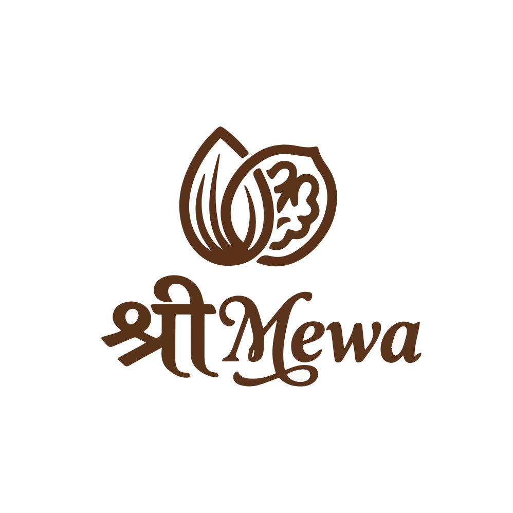

# Shree Mewa — Premium Dry Fruits & Handcrafted Gifting
> **Flagship Showroom:** Shop B-15, Bazar Samiti, Ramgarh Cantonment, Jharkhand — 829122  
> **Digital Boutique & Direct WhatsApp Concierge Platform**

<p align="center">
  
</p>

<p align="center">
  <a href="https://github.com/AgrShubham/ShreeMewa/actions"></a>
  <a href="https://react.dev/"></a>
  <a href="https://www.typescriptlang.org/"></a>
  <a href="https://vite.dev/"></a>
  <a href="https://tailwindcss.com/"></a>
  <a href="LICENSE"></a>
</p>

<p align="center">
  <b>FSSAI Lic.</b> <code>11122233344455</code> &nbsp;•&nbsp; 
  <b>GSTIN:</b> <code>20AAAAA0000A1Z5</code> &nbsp;•&nbsp; 
  <b>Desk:</b> <code>+91 7004584139</code> &nbsp;•&nbsp; 
  <b>Manager:</b> <code>+91 72098 13793</code>
</p>

---

## 🌟 Executive Summary

**Shree Mewa** is an artisanal dry fruits purveyor and ceremonial gifting boutique rooted in Ramgarh Cantonment, Jharkhand. 

Rather than relying on generic e-commerce checkout flows—which suffer from **>80% abandonment** in India for high-value ceremonial gifts—the platform implements a **High-Conversion Concierge Commerce Model**:
- Customers curate dry fruits by custom pack size (`250g`, `500g`, `1kg`) and select handcrafted hampers.
- Items are collected in a persistent **WhatsApp Inquiry Bag**.
- With one tap, a formatted, itemized inquiry string is generated and dispatched to the boutique's WhatsApp business desk with delivery preferences (Ramgarh Local, Store Pickup, Courier Dispatch).
- Direct human interaction closes festive bulk orders, corporate customization, and wedding trousseau inquiries with maximum trust and conversion.

---

## 📐 System Architecture

```mermaid
flowchart TD
    subgraph ClientLayer ["Client Presentation Tier (React 19 + Tailwind v4)"]
        UI_Nav["Sticky Navbar & Mobile Menu"]
        UI_Hero["Hero & Assurance Badges"]
        UI_Views["Code-Split Lazy Views (9 Views)"]
        UI_Modals["Product & Gift Detail Modals"]
        UI_Cart["WhatsApp Inquiry Bag Drawer"]
        UI_Catalogue["Digital Lookbook Modal"]
    end

    subgraph StateLayer ["State & Storage Tier"]
        CartCtx["CartContext (React Context API)"]
        Storage["localStorage Persistence ('shree_mewa_inquiry_bag_v1')"]
        Router["Hash-Based Deep-Linking & History Synchronizer"]
    end

    subgraph DataLayer ["Data & Domain Contracts (TypeScript 5.8)"]
        ProductsData["Single-Harvest Harvests (10 verified SKUs)"]
        GiftingData["Curated Hampers & Trays (6 verified SKUs)"]
        BizConfig["Business Config (Desks, FSSAI, GSTIN, Geo)"]
    end

    subgraph IntegrationLayer ["External Integrations & SEO"]
        WA["WhatsApp Click-to-Chat API (Direct Lead Pipeline)"]
        GA4["Google Analytics 4 (Measurement ID: G-2VQH3XNEV6)"]
        GMaps["Google Maps Embed & Directions API"]
        JSONLD["schema.org/LocalBusiness Structured JSON-LD"]
    end

    UI_Nav --> Router
    UI_Views --> CartCtx
    UI_Modals --> CartCtx
    CartCtx <--> Storage
    UI_Cart --> CartCtx

    UI_Views --> ProductsData
    UI_Views --> GiftingData
    UI_Views --> BizConfig

    UI_Cart --> WA
    UI_Views --> GMaps
    ClientLayer --> GA4
    ClientLayer --> JSONLD
```



---

## ✨ Core Capabilities

### 1. 🛍️ Multi-Item WhatsApp Inquiry Bag
- Real-time cart state with weight adjustments (`250g`, `500g`, `1kg`) and dynamic price computation.
- Delivery method selection:
  - 🚀 **Local Delivery (Ramgarh)** — Free above ₹1,500.
  - 🏬 **Showroom Pickup** — Ready in 1–2 hours at Bazar Samiti.
  - 📦 **Courier Dispatch** — Across Jharkhand & pan-India.
- One-click formatted WhatsApp dispatch compiling itemized lines, subtotal, and buyer delivery instructions.

### 2. 🌾 Verified Single-Harvest Dry Fruits
- Granular specifications for 10 harvest items: Iranian Mamra Almonds, California Supreme Almonds, King Cashews (W-180), Afghani Pistachios, Kashmiri Walnuts, Jordan Medjool Dates, Long Green Kishmish, Turkish Anjeer, and Sacred Panchmewa.
- Zero chemical polish, unadulterated origin guarantees, nutritional profiles, and culinary usage guidance.

### 3. 🎁 Handcrafted Keepsake Collections
- Teak finish wooden keepsake chests with antique brass clasps.
- Royal emerald velvet rigid boxes with hot-stamped gold foil mandalas.
- Hand-hammered pure brass platter sets and Banarasi brocade silk potli trios.
- Indicative budget ranges and custom personalization options (laser-engraved family names, monogram seals).

### 4. ⚡ Modern Performance Engineering
- **Vite 6** production builds with tree-shaking and route-level code splitting (`React.lazy` + `Suspense`).
- **Initial JS bundle optimized to 333 kB** (down from 407 kB) with individual lazy chunks for secondary views.
- Branded luxury Suspense fallback with rotating gold seal.
- Comprehensive `schema.org/LocalBusiness` JSON-LD schema with exact geo-coordinates (`23.6334° N, 85.5144° E`).
- Production `robots.txt` and `sitemap.xml` for complete search engine indexing.

---

## 📁 Repository Directory Structure

```
shree-mewa-boutique/
├── .github/
│   └── workflows/
│       └── ci.yml               # GitHub Actions CI (Typecheck & Production Build)
├── assets/                       # Vector brand assets and high-res crests
├── public/
│   ├── assets/                   # Publicly servable vector SVG logos
│   ├── robots.txt                # Search engine crawler policies
│   └── sitemap.xml               # Complete XML sitemap for SEO indexing
├── src/
│   ├── components/
│   │   ├── brand/                # Scalable multi-variant Logo & Seal component
│   │   ├── cart/                 # Multi-item WhatsApp Inquiry Bag Drawer
│   │   ├── catalogue/            # Digital Lookbook modal with print & native Web Share
│   │   ├── gifting/              # Gift cards and deep inspection modals
│   │   ├── home/                 # 10 Modular section components for HomeView
│   │   ├── layout/               # Sticky Navbar & global compliance Footer
│   │   ├── products/             # Product cards and nutritional detail modals
│   │   └── ui/                   # SectionHeading, SEOJsonLd, Suspense Fallback, WhatsApp Concierge
│   ├── context/
│   │   └── CartContext.tsx       # Global cart state engine with localStorage persistence
│   ├── data/
│   │   ├── business.ts           # Business info, contact desks, compliance & WA URL builder
│   │   ├── faqs.ts               # Categorized FAQ repository
│   │   ├── gifting.ts            # Curated gift box specifications & pricing
│   │   ├── navigation.ts         # Navigation items and bilingual badges
│   │   └── products.ts           # 10 single-harvest products with real pricing
│   ├── views/                    # 9 Lazy-loaded application views
│   │   ├── HomeView.tsx
│   │   ├── ProductsView.tsx
│   │   ├── GiftingView.tsx
│   │   ├── WeddingGiftingView.tsx
│   │   ├── CorporateGiftingView.tsx
│   │   ├── AboutView.tsx
│   │   ├── StoreView.tsx
│   │   ├── ContactView.tsx
│   │   └── CatalogueView.tsx
│   ├── types.ts                  # Domain models, cart contracts, and UI interfaces
│   ├── App.tsx                   # Main layout container and hash route synchronizer
│   ├── index.css                 # Custom scrollbars and Tailwind CSS v4 directives
│   └── main.tsx                  # React 19 application entry point
├── CLIENT_DATA_AND_ASSETS_CHECKLIST.md # Client intake inventory & integration status
├── index.html                    # Root HTML with Google Analytics 4 (G-2VQH3XNEV6) & OpenGraph
├── LICENSE                       # MIT License
├── package.json                  # Cleaned dependencies, scripts, and package metadata
├── tsconfig.json                 # TypeScript strict configuration
└── vite.config.ts                # Vite 6 config with React & Tailwind plugins
```

---

## 🚀 Getting Started

### Prerequisites
- **Node.js:** v18.0.0 or higher (v20+ LTS recommended)
- **Package Manager:** `npm` (v9+) or `yarn` / `pnpm`

### Local Development Setup

1. **Clone the repository:**
   ```bash
   git clone https://github.com/AgrShubham/ShreeMewa.git
   cd ShreeMewa
   ```

2. **Checkout the active integration branch:**
   ```bash
   git checkout experiment/client-data-integration
   ```

3. **Install dependencies:**
   ```bash
   npm install
   ```

4. **Launch the development server:**
   ```bash
   npm run dev
   ```
   Open [http://localhost:3000](http://localhost:3000) in your browser.

---

## 📜 Available NPM Scripts

| Command | Description |
| :--- | :--- |
| `npm run dev` | Runs the Vite dev server on port `3000` with hot module replacement (`--host=0.0.0.0`) |
| `npm run build` | Compiles the production bundle with TypeScript checks into `dist/` |
| `npm run preview` | Starts a local web server to preview the production build |
| `npm run lint` | Runs the TypeScript compiler (`tsc --noEmit`) to verify strict static typing |
| `npm run clean` | Cross-platform directory wipe of `dist/` using native Node.js ESM APIs |

---

## 🚢 Production Deployment

The project compiles to a pure, static SPA in `dist/` that can be deployed to any modern CDN or static host:

### Deploy on Vercel
```bash
npx vercel
```
*Framework Preset: Vite | Build Command: `npm run build` | Output Directory: `dist`*

### Deploy on Cloudflare Pages
```bash
npx wrangler pages deploy dist
```

### Deploy on Netlify
```bash
npx netlify deploy --prod --dir=dist
```

---

## 📄 License & Attribution

- **License:** MIT License — see [LICENSE](LICENSE) for details.
- **Client & Trademarks:** © 2026 Shree Mewa. All trade names, logos, and regional branding belong to Shree Mewa Boutique, Bazar Samiti, Ramgarh Cantonment, Jharkhand.
